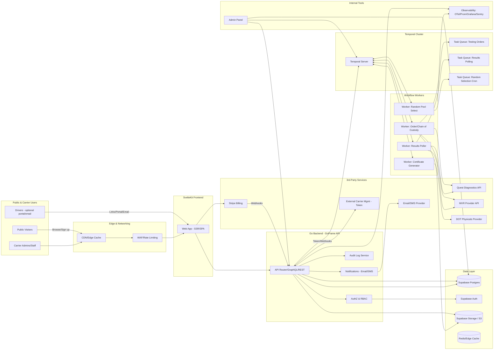
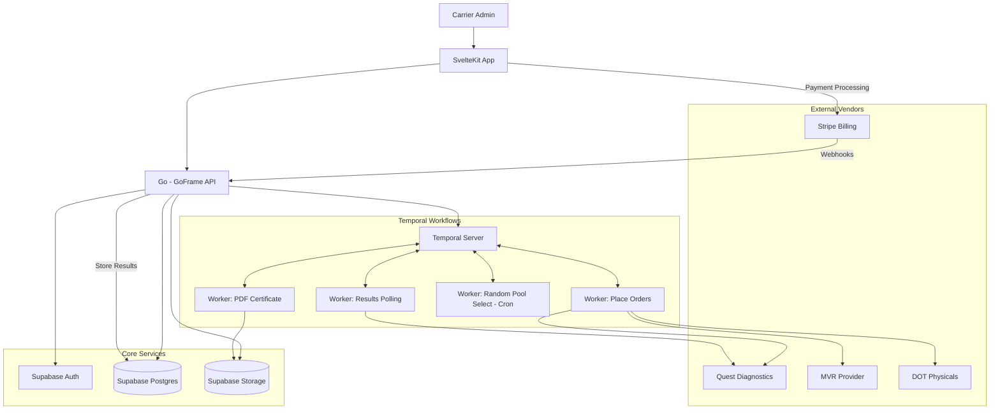
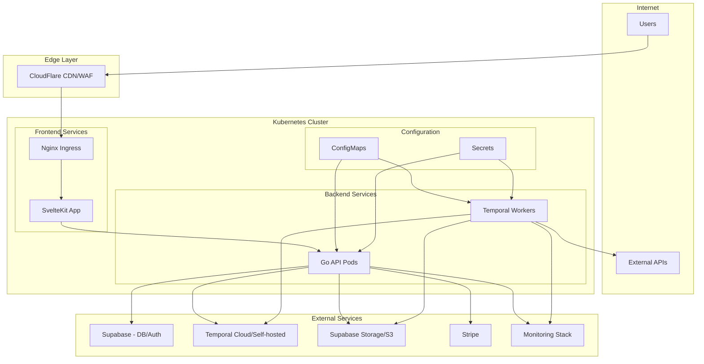

# System Architecture Diagrams

**Stack anchors:** Frontend: SvelteKit · Backend: Go (GoFrame) · Workflows: Temporal · DB/Auth: Supabase (Postgres) · Files: Supabase Storage (or S3-compatible) · Payments: Stripe · Testing Vendors: Quest Diagnostics API, MVR provider, DOT physicals · Integrations: External Carrier Mgmt (token)

---

## 1) High-Level Architecture (At Scale)



### Notes & Non-Functionals

* **Security:** JWT from Supabase Auth, role-based policies, row-level security; WAF + rate limiting at edge.
* **Scalability:** Horizontally scale Go API & Workers; Temporal cluster HA; Postgres with read replicas; queue backpressure via task queues.
* **Observability:** OpenTelemetry traces across FE→API→Temporal→Vendors; metrics (Prometheus) and error tracking (Sentry).
* **Resilience:** Idempotent activities; retries with exponential backoff; circuit breakers for vendor APIs.
* **Compliance:** Immutable audit logs; time-stamped selection records; PII encryption at rest; signed URLs for documents.

---

## 2) MVP Architecture (Scope-Reduced)



### MVP Feature Map

* **Auth & Subscription:** Supabase Auth + Stripe (annual Jan–Dec).
* **Driver Mgmt:** CRUD in Postgres; document uploads to Storage.
* **Ordering & Results:** Temporal workflow per order; activities: create request, poll status, persist results.
* **Random Testing:** Temporal cron selects N% from active driver pool; writes selection + notifies; generates selection report PDF.
* **Certificates:** Generate “Consortium Membership Certificate” and test completion certificates; store in Storage with signed URL download.

---

## 3) Key Workflows (Sequence Sketches)

### A. Order Drug Test

1. Carrier clicks “Order Test” → API validates subscription & driver.
2. API starts **Temporal workflow** `DrugTestOrderWF(driver, vendor)`.
3. Activity: create order at vendor (Quest) → returns requisition/CCF.
4. Activity: poll status until complete (with jitter, backoff).
5. On completion: store results in DB, PDF in Storage; emit event to integrations.

### B. Random Selection (Quarterly)

1. **Temporal Cron** triggers `RandomSelectionWF(carrier, pool, rate%)`.
2. Query active drivers → select sample with seed & audit hash.
3. Persist selection, generate **Random Selection Report PDF**.
4. Notify carrier & (optionally) drivers; create tasks for ordering.

### C. Certificate Generation

1. API or workflow requests `CertificateGenerateActivity(type, data)`.
2. Render PDF (Go PDF lib) → write to Storage; return signed URL.
3. Expose download in UI & via integration token.

---

## 4) Data Model Highlights (MVP)

```sql
-- Core tables for MVP implementation

-- Carriers table
carriers (
  id UUID PRIMARY KEY,
  name VARCHAR NOT NULL,
  dot_number VARCHAR UNIQUE NOT NULL,
  subscription_status VARCHAR NOT NULL CHECK (subscription_status IN ('active', 'inactive', 'suspended')),
  renewal_month INTEGER DEFAULT 1, -- January
  created_at TIMESTAMP DEFAULT NOW(),
  updated_at TIMESTAMP DEFAULT NOW()
);

-- Users table
users (
  id UUID PRIMARY KEY,
  carrier_id UUID REFERENCES carriers(id),
  email VARCHAR UNIQUE NOT NULL,
  role VARCHAR NOT NULL CHECK (role IN ('admin', 'staff', 'viewer')),
  created_at TIMESTAMP DEFAULT NOW()
);

-- Drivers table
drivers (
  id UUID PRIMARY KEY,
  carrier_id UUID REFERENCES carriers(id),
  cdl_number VARCHAR UNIQUE NOT NULL,
  first_name VARCHAR NOT NULL,
  last_name VARCHAR NOT NULL,
  status VARCHAR NOT NULL CHECK (status IN ('active', 'inactive', 'suspended')),
  created_at TIMESTAMP DEFAULT NOW(),
  updated_at TIMESTAMP DEFAULT NOW()
);

-- Orders table
orders (
  id UUID PRIMARY KEY,
  driver_id UUID REFERENCES drivers(id),
  type VARCHAR NOT NULL CHECK (type IN ('drug', 'physical', 'mvr')),
  vendor VARCHAR NOT NULL,
  status VARCHAR NOT NULL CHECK (status IN ('pending', 'processing', 'completed', 'failed')),
  result_url VARCHAR,
  created_at TIMESTAMP DEFAULT NOW(),
  completed_at TIMESTAMP
);

-- Random testing pools
random_pools (
  id UUID PRIMARY KEY,
  carrier_id UUID REFERENCES carriers(id),
  frequency VARCHAR NOT NULL CHECK (frequency IN ('monthly', 'quarterly', 'annually')),
  percentage INTEGER NOT NULL CHECK (percentage > 0 AND percentage <= 100),
  created_at TIMESTAMP DEFAULT NOW()
);

-- Random selections audit trail
random_selections (
  id UUID PRIMARY KEY,
  pool_id UUID REFERENCES random_pools(id),
  run_at TIMESTAMP NOT NULL,
  seed VARCHAR NOT NULL,
  selection_hash VARCHAR NOT NULL,
  selected_drivers JSONB NOT NULL,
  created_at TIMESTAMP DEFAULT NOW()
);

-- Certificates and documents
certificates (
  id UUID PRIMARY KEY,
  carrier_id UUID REFERENCES carriers(id),
  driver_id UUID REFERENCES drivers(id), -- NULL for carrier-level certs
  type VARCHAR NOT NULL CHECK (type IN ('consortium_membership', 'test_completion', 'random_selection_report')),
  file_url VARCHAR NOT NULL,
  created_at TIMESTAMP DEFAULT NOW()
);

-- Third-party integrations
integrations (
  id UUID PRIMARY KEY,
  carrier_id UUID REFERENCES carriers(id),
  provider VARCHAR NOT NULL,
  token VARCHAR NOT NULL,
  scopes JSONB,
  created_at TIMESTAMP DEFAULT NOW()
);

-- Audit logs for compliance
audit_logs (
  id UUID PRIMARY KEY,
  actor VARCHAR NOT NULL, -- user id or system
  action VARCHAR NOT NULL,
  entity VARCHAR NOT NULL, -- table name
  entity_id UUID NOT NULL,
  changes JSONB,
  timestamp TIMESTAMP DEFAULT NOW()
);
```

---

## 5) Deployment Architecture



### Deployment Notes

* **Container Orchestration:** Kubernetes (EKS/GKE/AKS) or Docker Compose for local dev
* **API Scaling:** Horizontal pod autoscaler based on CPU/memory metrics
* **Worker Scaling:** Scale based on Temporal task queue depth
* **Database:** Managed Supabase or self-hosted PostgreSQL with replicas
* **Observability:** Prometheus metrics, Grafana dashboards, OpenTelemetry tracing
* **Security:** Network policies, RBAC, secret management via Kubernetes secrets

---

### Legend

* Solid arrows: synchronous HTTP calls
* Double arrows: workflow (Temporal) command/task interaction
* Dashed arrows (implicit above): async notifications/webhooks
